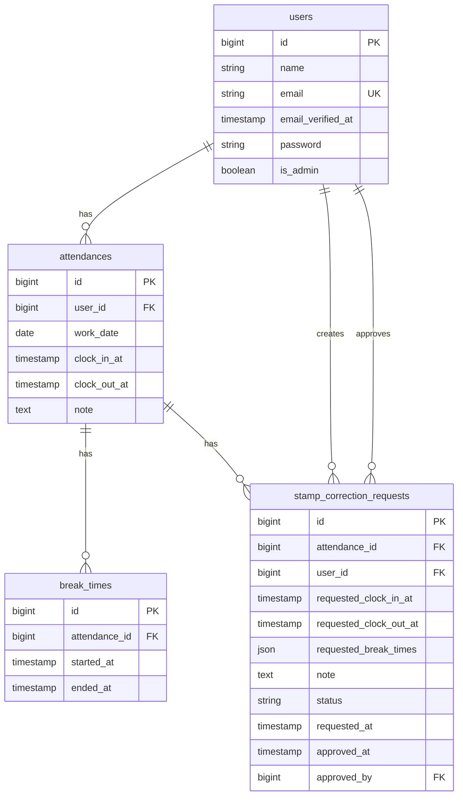

# COACHTECH 勤怠管理アプリ

Laravel・Fortify・MySQL・Docker で構築した勤怠管理アプリです。  
一般ユーザーの打刻、勤怠修正申請、管理者の勤怠確認と承認までを実装しています。

## 環境構築

1. リポジトリを取得して `.env.example` を `.env` にコピーします。
2. Docker を起動してコンテナを立ち上げます。
3. 依存関係をインストールし、アプリケーションキーを作成します。
4. マイグレーションとシーディングを実行します。

```bash
cp .env.example .env
docker compose up -d --build
docker compose exec php composer install
docker compose exec php php artisan key:generate
docker compose exec php php artisan migrate:fresh --seed
```

## 使用技術

- PHP 8.5
- Laravel 13
- Laravel Fortify
- MySQL 8.4
- Nginx 1.27
- Docker / Docker Compose
- MailHog

## URL

- 一般ユーザー: http://localhost/login
- 管理者: http://localhost/admin/login
- MailHog: http://localhost:8025

## ログイン情報

- 管理者
  - email: `admin@coachtech.com`
  - password: `password`
- 一般ユーザー
  - email: `reina.n@coachtech.com`
  - password: `password`

## ダミーデータ

- 管理者1名
- 一般ユーザー6名
- 当月の勤怠データ
- 承認待ち申請1件
- 承認済み申請1件

## ER 図

- Mermaid版: `docs/ERD.md`
- 画像版: `docs/ERD.svg`


