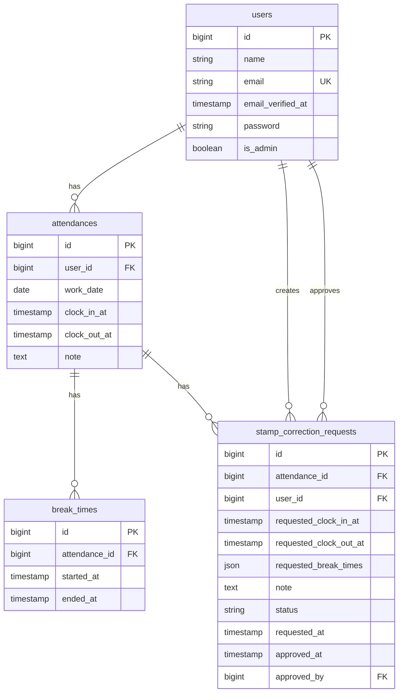

# COACHTECH 勤怠管理アプリ

Laravel・Fortify・MySQL・Docker で構築した勤怠管理アプリです。  
一般ユーザーの打刻、勤怠修正申請、管理者の勤怠確認と承認までを実装しています。

## 環境構築

1. Docker Desktop を起動します。
2. プロジェクト直下で初期化コマンドを実行します。

```bash
make init
```

手動で実行する場合は、以下のコマンドを順番に実行してください。

```bash
docker compose up -d --build
docker compose exec php composer install
docker compose exec php cp .env.example .env
docker compose exec php php artisan key:generate
docker compose exec php php artisan migrate:fresh --seed
```

Laravel 本体は `src` ディレクトリ配下に配置しています。

## テスト環境

PHPUnit は MySQL のテスト用データベース `demo_test` を使用します。  
アプリ本体の `attendance` とは別に、テスト専用のデータベースを作成してください。

```bash
docker compose exec mysql mysql -uroot -proot -e "CREATE DATABASE IF NOT EXISTS demo_test CHARACTER SET utf8mb4 COLLATE utf8mb4_unicode_ci;"
```

テスト用の環境設定は `.env.testing` に記載しています。

```env
DB_CONNECTION=mysql
DB_HOST=mysql
DB_PORT=3306
DB_DATABASE=demo_test
DB_USERNAME=root
DB_PASSWORD=root
```

テスト実行前に、テスト用データベースへマイグレーションを実行します。

```bash
docker compose exec php php artisan config:clear
docker compose exec php php artisan migrate:fresh --env=testing
docker compose exec php ./vendor/bin/phpunit
```

Makefile を使用する場合は、以下のコマンドで同じ手順を実行できます。

```bash
make test
```

実装済みのテスト内容は以下です。

- 認証: 会員登録、ログイン、管理者ログイン、メール認証、認証メール再送
- 一般ユーザー勤怠: 出勤、休憩入、休憩戻、退勤、勤務ステータス表示
- 一般ユーザー勤怠一覧: 月別一覧、前月/翌月表示、勤怠詳細リンク
- 勤怠修正申請: 入力バリデーション、申請作成、承認待ち申請の二重申請防止
- 管理者: 日別勤怠一覧、勤怠詳細更新、スタッフ一覧、スタッフ別月次一覧、CSV出力
- 申請承認: 申請一覧のステータス絞り込み、承認処理、一般ユーザーによる承認操作の拒否
- FormRequest: 月/日付/ステータスのクエリ検証、パスワード/プロフィール更新の検証、管理者権限検証

## 使用技術

- PHP 8.5
- Laravel 13
- Laravel Fortify
- MySQL 8.4
- Nginx 1.27
- Docker / Docker Compose
- MailHog

## URL

- 一般ユーザーログイン: http://localhost/login
- 管理者ログイン: http://localhost/admin/login
- MailHog: http://localhost:8025

ログイン後に利用する主な画面は以下です。

- 一般ユーザー打刻画面: `/attendance`
- 一般ユーザー勤怠一覧: `/attendance/list`
- 管理者勤怠一覧: `/admin/attendance/list`

## ログイン情報

- 管理者
  - email: `admin@coachtech.com`
  - password: `password`
- 一般ユーザー
  - email: `reina.n@coachtech.com`
  - password: `password`

## ダミーデータ

- 管理者1名
- 一般ユーザー6名
- 当月の勤怠データ
- 承認待ち申請1件
- 承認済み申請1件

## 動作確認

- 一般ユーザーでログイン後、出勤・休憩入・休憩戻・退勤ができます。
- 一般ユーザーは勤怠詳細から修正申請を送信できます。
- 管理者は日次勤怠一覧、スタッフ別月次一覧、申請承認、CSV出力を利用できます。
- 自動テストは `make test` で実行できます。

## ER 図

- Mermaid版: `docs/ERD.md`
- 画像版: `docs/ERD.svg`


