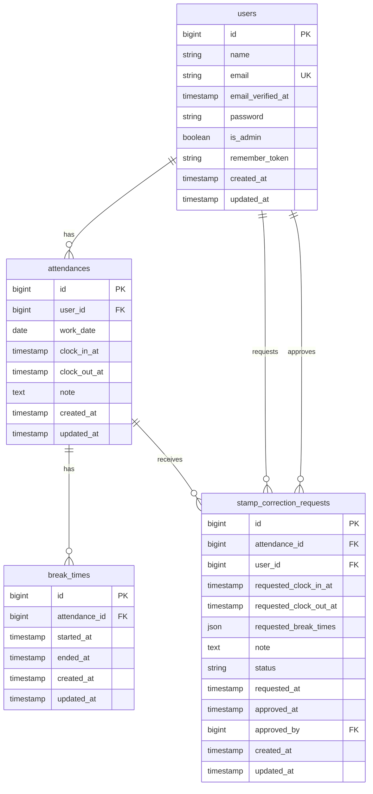

# ER Diagram

```mermaid
erDiagram
    users {
        bigint id PK
        string name
        string email UK
        timestamp email_verified_at
        string password
        boolean is_admin
        string remember_token
        timestamp created_at
        timestamp updated_at
    }

    attendances {
        bigint id PK
        bigint user_id FK
        date work_date
        timestamp clock_in_at
        timestamp clock_out_at
        text note
        timestamp created_at
        timestamp updated_at
    }

    break_times {
        bigint id PK
        bigint attendance_id FK
        timestamp started_at
        timestamp ended_at
        timestamp created_at
        timestamp updated_at
    }

    stamp_correction_requests {
        bigint id PK
        bigint attendance_id FK
        bigint user_id FK
        timestamp requested_clock_in_at
        timestamp requested_clock_out_at
        json requested_break_times
        text note
        string status
        timestamp requested_at
        timestamp approved_at
        bigint approved_by FK
        timestamp created_at
        timestamp updated_at
    }

    users ||--o{ attendances : has
    attendances ||--o{ break_times : has
    attendances ||--o{ stamp_correction_requests : receives
    users ||--o{ stamp_correction_requests : requests
    users ||--o{ stamp_correction_requests : approves
```
